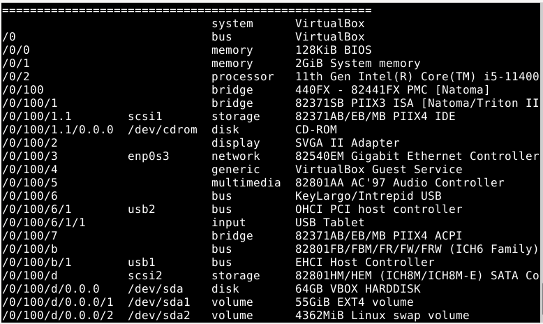
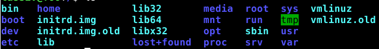

# Komentaja Pingviini

Aloitin lataamalla micro editorin kirjoittamalla terminaaliin komennon 

    curl https://getmic.ro | bash
    
Seuraavaksi asensin lshw työkalun saadakseni enemmän tietoa virtuaalikoneestani komennolla 

    $ sudo apt-get install lshw

 

Kuten analyysistä näkyy host koneessani on prossuna i5-11400F sekä annoin virtuaalikoneeseen 2 gigaa muistia 

## Komentoriviohjelmien lataus

Seuraavaksi latasin kolme hyödyllistä komentoriviohjelmaa käyttämällä komentoa 

    $ sudo apt install cmatrix cowsay fortune
    
## Tärkeät kansiot

Ensimmäinen tärkeä kansio on root, jonka sisällä kaikki tiedostot ovat. Roottiin pääsin kirjoittamalla komentokehotteeseen 

    cd /
    
Oma roottini näyttää tältä. 

