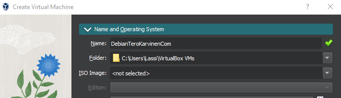

Virtuaalikoneen teko ja linuxin lataaminen siihen sujui hyvin. Ainoa eroavaisuus ohjeisiin verrattuna oli ISO image kohdan valitseminen jo ennen virtuaalikoneen tekemistä. Virtuaalikonetta ladattaessa Oracle valitti python versiosta
 
 

 
 Käyttöjärjestelmä: 
 WIN 10 Home
 
 Ram: 
 32 GB
 
 Fyysistä muistia: 
 500GB
 
 
 Virtuaaliohjelmistona toimii Oraclen VM VirtualBox Manager
 
 Debianin Iso tiedosto: debian-live-11.6.0-amd64-xfce+nonfree.iso.
 
Markup :  ## Heading 2 ##
 
 Aloitin lataamalla Oraclen VM VirtualBox Managerin Oraclen omilta nettisivuilta. Seuraavaksi myös asensin Debian ISO tiedoston hakemalla netistä "debian non-free live iso". Tarvitsemme ISO tiedostoa myöhemmin tehdessämme virtuaalikonetta.
 
 Kun VirtualBox on ladattu ja käynnistettu uuden virtuaalikoneen saa tehtyä painamalla vasemmalla ylävalikossa "machine" ja alasvetovalikosta "new", joka vie virtuaalikoneen luontinäkymään. "name" kohtaan voi laittaa minkä haluaa virtuaalikoneensa nimeksi. Folder ainakin itsellä meni suoraan oikeaksi eli pidä se oletussijaintina. Iso imageen laitetaan juuri lataamamme Debian ISO tiedoston tiedostosijainti. Typeen tulee Linux ja versioon Debian 64-bit. Memoryyn ja prosessorien määrään voi laittaa mitä vain mutta suosittelen ainakin 4 gigaa ramia. Prosessorejakin voi laittaa monta mutta suosittelen käyttämään vain yhtä.
 
 Lopuksi paina "Finish" valikon oikeasta alareunasta
 
 Nyt sinulla on oma virtuaalinen linux tietokone!
 
 Kun olet käynnistänyt virtuaalitietokoneesi kannattaa käydä kokeilemassa toimiihan selain oikein valitsemalla virtuaalikoneen vasemmasta yläreunasta "Applications" ja 
 "Web Browser". Jos selain toimii normaalisti valitse vielä työpöydältä "install debian" pikakuvake, jolla voimme asentaa debianin virtuaalikoneelle.
 
 Debianin asentamisen jälkeen käynnistä virtuaalikone uudestaan ja nauti.

